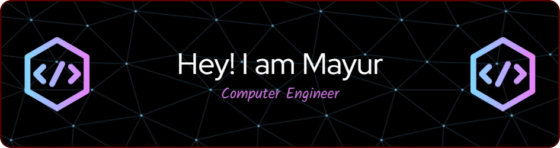

<h1 align="center">Hi 👋, I'm Mayur</h1>
<h3 align="center">I love Automating Stuff</h3>

  

  

- 📫 How to reach me **mayurgadakh12@email.com**

- ⚡ Fun fact **I am a fool**

<h3 align="left">Connect with me:</h3>

     

<h3 align="left">Languages and Tools:</h3>

                 

&nbsp;

