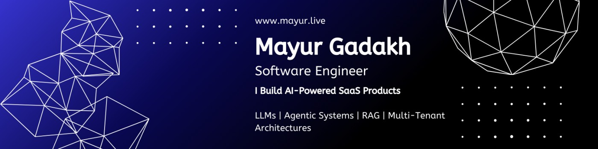

<h1 align="center">Mayur Gadakh</h1>
<h3 align="center">Full-Stack Software Engineer | AI-Powered SaaS Builder | India 🇮🇳</h3>

  <b>1.5+ years</b> building production web applications with <b>React, Node.js, PostgreSQL, and AI APIs</b> 
  Shipped <b>multi-tenant SaaS platforms</b> used by real users | Strong focus on <b>backend reliability & performance</b>

  

---

## Featured Project: DocUp (AutoDocs)

  
### **[docup.dev](https://docup.dev)** - AI-Powered Documentation-as-a-Service

**The Problem:** Developers spend hours writing and maintaining documentation. Outdated docs lead to confusion and wasted time.

**The Solution:** DocUp automatically generates structured, searchable documentation from GitHub repositories using AI.

<table>
<tr>
<td width="50%">

### Key Features
- **Automatic Doc Generation** from GitHub repos
- **AI-Powered Search** with semantic understanding
- **Multi-Tenant Architecture** with isolated environments
- **Real-time Updates** when code changes
- **Custom Domain Support** for each project
- **MDX-based Documentation** with rich formatting

</td>
<td width="50%">

### Technical Architecture
- **Embeddings Pipeline** for large-scale repo indexing
- **Chunking Strategies** for optimal context retrieval
- **Parallel Workers** for high-throughput processing
- **Row-Level Security (RLS)** via Supabase
- **Domain-Level Sandboxing** for tenant isolation
- **Vector Search** powered by Qdrant

</td>
</tr>
</table>

**Tech Stack:**  
`Next.js` `TypeScript` `LangChain` `OpenAI API` `Qdrant (Vector DB)` `Supabase (PostgreSQL)` `MDX` `Vercel` `Multi-tenant SaaS Architecture`

**Impact:** Reduces manual documentation effort by 80%+ for development teams.

> **Why This Matters:** Built a production-grade RAG system that handles repository parsing, intelligent chunking, vector embeddings, and semantic search — all while maintaining strict tenant isolation and security.

---

## Professional Experience

### Bhumeet Digital Pvt. Ltd. — Junior Software Engineer
**March 2025 - Jan 2026** | Remote | [bhumeet.in](https://bhumeet.in)

### Manasvi Tech Solutions Pvt. Ltd. — Junior Fullstack Developer
**Jun 2024 - Feb 2025** | Nashik | [manasvi.tech](https://manasvi.tech)

---

## Tech Stack & Skills

### Core Technologies

<table>
  <tr>
    <th align="center">Frontend</th>
    <th align="center">Backend & APIs</th>
    <th align="center">Database & Storage</th>
    <th align="center">AI & ML</th>
  </tr>
  <tr>
    <td align="center">
      
    </td>
    <td align="center">
      
    </td>
    <td align="center">
      
    </td>
    <td style="display:'flex'" align="center">
      
      
      
      
      
    </td>
  </tr>
</table>

### Infrastructure & Tools

<table align="center">
<tr>
<td>

**Backend & Architecture**
- REST APIs & GraphQL
- Multi-tenant SaaS Design
- Row-Level Security (RLS)
- Authentication (NextAuth, BetterAuth)
- Background Job Processing (Inngest)

</td>
<td>

**AI & ML Systems**
- RAG (Retrieval-Augmented Generation)
- LangChain & OpenAI API
- Vector Embeddings & Semantic Search
- Prompt Engineering
- LLM Integration & Optimization

</td>
<td>

**DevOps & Performance**
- CI/CD Pipelines
- Docker Containerization
- Database Optimization
- Performance Profiling
- Code Splitting & Lazy Loading

</td>
</tr>
</table>

---

## Other Notable Projects

### [ResumeAI (Resumly)](https://resumly.dev)
**AI-Powered Resume Builder** | *August 2025*

- **SaaS platform** for structured JSON resume parsing, LLM-powered tailoring, and PDF export
- Built with **React, Node.js, Supabase (PostgreSQL), Auth.js, Azure Blob Storage**
- Designed **prompt chaining architecture** for intelligent resume optimization
- Implemented **background job handling** with Inngest for scalable AI processing

**Tech:** `OpenAI API` `Next.js` `PostgreSQL` `Azure` `Inngest` `Auth.js`

---

## GitHub Analytics

  
  

  

---

## What I'm Learning

- **Advanced RAG Techniques** — Fine-tuning retrieval strategies for better context accuracy
- **Distributed Systems** — Building scalable, fault-tolerant architectures
- **System Design** — Designing production-grade applications from scratch
- **Performance Engineering** — Database optimization, caching strategies, and query profiling

---

## Philosophy

> **"Code. Learn. Build. Ship. Repeat."**

I believe in **karma, consistency, and continuous self-improvement**. Every project is an opportunity to learn something new and build something that matters.

- **Ship real products** that solve real problems
- **Write clean, maintainable code** that others can understand
- **Own the full stack** from database to deployment
- **Learn in public** and share knowledge with the community

---

### Profile Views

---

**Open to opportunities** | Full-Stack & AI Engineering Roles | Remote/Hybrid

